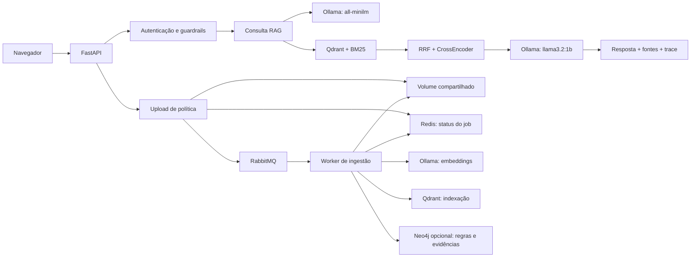
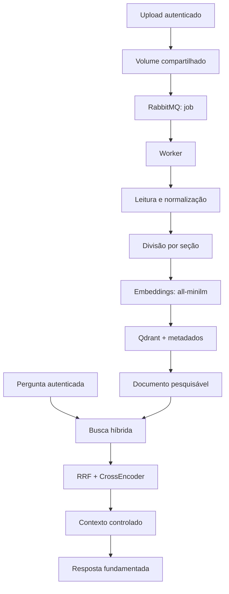

# Onfly Policy Copilot

Case técnico independente de um assistente para consulta de políticas corporativas de viagens. A aplicação busca trechos autorizados antes de responder, mantém empresas isoladas e apresenta as fontes utilizadas.

O projeto usa somente dados sintéticos e não representa um produto oficial da Onfly.

## O que a solução demonstra

- autenticação com duas identidades fictícias;
- base de conhecimento com 70 documentos catalogados sobre dúvidas comuns de viagem;
- expansão temática cobrindo passagens, hospedagem, alimentação, transporte, reembolso, cartão, viagens internacionais, aprovação, cancelamento e segurança;
- isolamento de documentos por empresa, também chamada de tenant;
- ingestão versionada e sem duplicação;
- ingestão assíncrona por upload, RabbitMQ e worker;
- status de jobs persistido no Redis;
- grafo de conhecimento opcional em Neo4j para regras e relações auditáveis;
- busca vetorial com Qdrant e busca por palavras com BM25;
- combinação dos rankings com RRF e reordenação com CrossEncoder;
- geração local com `llama3.2:1b` pelo Ollama;
- resposta estruturada, fontes, confiança, trace e `request_id`;
- bloqueio de prompt injection e mascaramento de dados em logs;
- feedback associado à resposta e ao tenant autenticado;
- avaliação reproduzível, gate de regressão, Docker e CI.

## Arquitetura resumida



RAG significa geração apoiada por recuperação: o modelo recebe trechos encontrados nas políticas em vez de responder apenas com conhecimento próprio.

## Pipeline RAG em detalhes

O pipeline abaixo explica o caminho completo entre uma política e uma resposta. Os nomes técnicos aparecem acompanhados de uma explicação simples.



1. Os documentos sintéticos de cada empresa são lidos, normalizados e divididos em trechos menores. A divisão preserva títulos e seções para manter o sentido da regra.
2. Cada trecho recebe um *embedding*: uma representação numérica do seu significado, gerada localmente pelo modelo `all-minilm`.
3. Os trechos, seus embeddings e metadados são guardados no Qdrant. Os metadados incluem empresa, documento, versão, seção, validade e estado ativo. Hashes evitam a duplicação durante uma nova carga.
4. Ao entrar, a pessoa recebe um token sintético assinado. A empresa vem desse token; ela nunca é enviada pelo navegador no corpo da pergunta.
5. A pergunta passa por uma checagem de segurança. Em seguida, a busca vetorial encontra trechos com significado parecido e o BM25 encontra palavras importantes. O filtro da empresa autenticada é aplicado em toda recuperação.
6. O RRF combina os dois rankings de busca. Depois, o CrossEncoder compara diretamente pergunta e trecho para ordenar os candidatos mais relevantes.
7. O sistema remove trechos repetidos e limita o tamanho do contexto. Assim, o modelo recebe evidências suficientes sem uma quantidade desnecessária de texto.
8. Para as perguntas frequentes de bagagem, hotel, reembolso e transporte por aplicativo, a aplicação monta uma resposta clara a partir das fontes recuperadas. Nas demais perguntas, o `llama3.2:1b` gera uma resposta estruturada usando somente o contexto autorizado.
9. A API devolve a resposta, as fontes usadas, a confiança e um `request_id`, que é o identificador da requisição. Quando não há evidência suficiente, ela informa isso em vez de inventar uma política.
10. A ingestão HTTP retorna `202 Accepted` depois de salvar o upload e publicar um job. O worker executa embeddings e indexação fora do processo da API; o status fica disponível por `GET /v1/ingestion/{job_id}`.

Leia a descrição completa em [Pipeline RAG](docs/rag-pipeline-explicacao-local-v1.md).

## Tecnologias

| Tecnologia | Função |
|---|---|
| FastAPI e Pydantic | API HTTP e validação dos contratos |
| Ollama | execução local dos modelos de embedding e geração |
| Qdrant | persistência e busca vetorial |
| BM25 e RRF | busca por palavras e combinação de rankings |
| CrossEncoder | reordenação dos trechos por relevância |
| LangChain | interfaces intercambiáveis para Ollama, modelos e embeddings |
| LangGraph | orquestração determinística das etapas da consulta |
| LangSmith | tracing opcional, avaliação e observação protegida |
| LlamaIndex | representação dos documentos e adaptador do Qdrant |
| RabbitMQ | fila durável, retries e dead-letter de ingestão |
| Redis | status temporário dos jobs com TTL |
| Neo4j | grafo opcional de políticas, regras, condições e evidências |
| pytest, Ruff e mypy | testes, qualidade e verificação de tipos |
| Docker Compose | API, worker, RabbitMQ, Redis, Neo4j e Qdrant reproduzíveis |

Os quatro frameworks complementam o código próprio do projeto; regras de segurança, isolamento por empresa, busca híbrida, RRF e re-ranking continuam sob controle da aplicação. Veja [Integração de frameworks](docs/rag-frameworks-integracao-tecnica-v1.md) para responsabilidades, configuração e limites.

## Pré-requisitos

- Python entre 3.11 e 3.14;
- [uv](https://docs.astral.sh/uv/);
- Ollama em execução;
- modelos `llama3.2:1b` e `all-minilm`;
- Docker Desktop para a execução em containers.

```powershell
ollama pull llama3.2:1b
ollama pull all-minilm
ollama list
```

## Executar localmente

```powershell
uv sync --dev
Copy-Item .env.example .env
uv run python -m scripts.seed_demo
uv run uvicorn app.main:app --reload
```

Acesse [http://localhost:8000](http://localhost:8000). Essa execução usa Uvicorn diretamente e não inicia RabbitMQ, Redis ou Neo4j. Não abra `app/web/index.html` diretamente: a interface depende da API.

A carga inicial indexa as políticas versionadas e os catálogos de dúvidas das duas empresas sintéticas. Somente a versão ativa de cada política participa da busca. Repetir o seed não duplica dados.

## Credenciais da demonstração

| Empresa | Usuário | Senha | Regra de alimentação |
|---|---|---|---:|
| Aurora Tecnologia | `aurora.demo` | `Aurora#2026` | R$ 130,00 por dia |
| Brisa Sistemas | `brisa.demo` | `Brisa#2026` | R$ 85,00 por dia |

As credenciais são públicas porque pertencem somente ao conjunto sintético. O repositório armazena os hashes das senhas, não senhas reais.

## Executar com Docker

O Compose inicia a API, o worker, RabbitMQ, Redis e Qdrant. API e worker compartilham o volume de uploads. O Ollama continua no computador e é acessado pelo endereço `host.docker.internal`. Por padrão, a API fica em `http://localhost:8010`; use `APP_PUBLISHED_PORT=8000` se essa porta estiver livre.
O Compose também inicia o Neo4j e habilita a construção do grafo no worker; o modo local fora do Compose mantém `KNOWLEDGE_GRAPH_ENABLED=false` por padrão.

```powershell
docker compose build
docker compose up -d
docker compose exec api python -m scripts.seed_demo
```

O comando `docker compose build` é necessário quando o código do worker ou da API mudou, porque a imagem Docker pode estar armazenada localmente. No Compose, a interface fica em [http://localhost:8010](http://localhost:8010); a porta interna do container continua sendo `8000`.

Para enviar uma política pelo endpoint assíncrono, use um token obtido em `/v1/auth/login`:

```powershell
$token = "SEU_TOKEN"
curl.exe -X POST http://localhost:8010/v1/ingestion `
  -H "Authorization: Bearer $token" `
  -F "file=@data/tenants/aurora_tecnologia/policy.md" `
  -F "document_id=policy" `
  -F "title=Política de viagens" `
  -F "version=v3" `
  -F "valid_from=2026-01-01"
```

O endpoint responde `202 Accepted` com um `job_id`. Consulte o processamento assim:

```powershell
curl.exe http://localhost:8010/v1/ingestion/JOB_ID `
  -H "Authorization: Bearer $token"
```

Quando `KNOWLEDGE_GRAPH_ENABLED=true`, consulte regras estruturadas por tema:

```powershell
curl.exe "http://localhost:8010/v1/knowledge-graph/rules?topic=alimentação" `
  -H "Authorization: Bearer $token"
```

O fluxo é implementado em [`app/main.py`](app/main.py#L270), publicado por [`app/messaging/rabbitmq.py`](app/messaging/rabbitmq.py#L20) e processado em [`app/worker/ingestion_worker.py`](app/worker/ingestion_worker.py#L26).

Para encerrar:

```powershell
docker compose down
```

O volume do Qdrant é preservado. Use `docker compose down --volumes` somente quando quiser apagar conscientemente o índice criado pelo Compose.

## Endpoints principais

| Método | Caminho | Finalidade |
|---|---|---|
| `GET` | `/` | interface demonstrativa |
| `GET` | `/health` | confirma que a API está viva |
| `GET` | `/ready` | verifica Ollama e Qdrant |
| `POST` | `/v1/auth/login` | cria a sessão fictícia |
| `POST` | `/v1/ask` | consulta políticas autorizadas |
| `POST` | `/v1/ingestion` | recebe uma política e enfileira a ingestão (`202`) |
| `GET` | `/v1/ingestion/{job_id}` | consulta o status da ingestão do tenant |
| `GET` | `/v1/knowledge-graph/rules?topic=...` | consulta regras explícitas do tenant quando Neo4j está habilitado |
| `POST` | `/v1/feedback` | registra avaliação da resposta |
| `GET` | `/metrics` | apresenta métricas operacionais no formato do Prometheus |
| `GET` | `/metrics/ui` | painel de visualização das métricas operacionais |
| `GET` | `/docs` | documentação interativa Swagger |

O corpo de `/v1/ask` aceita somente a pergunta. O tenant vem exclusivamente do token autenticado.

## Testes e qualidade

```powershell
uv run ruff format --check app tests scripts
uv run ruff check app tests scripts
uv run mypy app tests scripts
uv run pytest
```

A suíte cobre contratos HTTP, ingestão, versionamento, retrieval, re-ranking, autenticação, isolamento entre tenants, prompt injection, indisponibilidade do Ollama, logs, observabilidade, front-end, feedback, Docker e regressão de qualidade.

## Avaliações reproduzíveis

```powershell
uv run python -m scripts.evaluate_retrieval --output docs/evidence/phase3_retrieval_results.json
uv run python -m scripts.evaluate_reranking --output docs/evidence/phase4_reranking_results.json
uv run python -m scripts.evaluate_golden --output docs/evidence/phase7_golden_results.json
uv run python -m scripts.check_regression --report docs/evidence/phase7_golden_results.json
```

O resultado congelado da versão apresentada está em [`docs/evidence/release_1_0_0.json`](docs/evidence/release_1_0_0.json). A apresentação técnica está em [`docs/presentation/onfly-policy-copilot-1.0.0.pptx`](docs/presentation/onfly-policy-copilot-1.0.0.pptx).

## Estrutura do repositório

```text
app/
├── core/            configuração, autenticação, erros e logs
├── domain/          modelos e contratos da API
├── evaluation/      métricas e gate de regressão
├── feedback/        feedback ligado à requisição e ao tenant
├── generation/      provedor Ollama, prompt e fallback
├── guardrails/      proteção da pergunta, fonte e tenant
├── ingestion/       leitura, normalização, chunks e indexação
├── knowledge_graph/  extração e persistência de regras no Neo4j
├── messaging/       contratos, RabbitMQ e estado Redis dos jobs
├── observability/   health, readiness, métricas e trace
├── retrieval/       Qdrant, BM25, RRF, contexto e re-ranking
├── web/             interface demonstrativa
├── worker/          consumidor assíncrono de ingestão
└── main.py          ponto de entrada da API
data/
├── auth/            usuários sintéticos
├── evaluation/      perguntas, golden dataset e limites
└── tenants/         políticas e documentos de ajuda das duas empresas
docs/
├── adr/             decisões arquiteturais relevantes
├── evidence/        resultados reproduzíveis
└── presentation/    apresentação técnica
scripts/             ingestão, seed, avaliações e verificações
tests/               testes unitários, integrados e de segurança
```

## Documentação técnica

- [Catálogo e organização do repositório](docs/repositorio-catalogo-classificacao-github-v1.md)
- [Arquitetura](docs/rag-arquitetura-explicacao-local-v1.md)
- [Ontologia do grafo de conhecimento](docs/rag-ontologia-conhecimento-v1.md)
- [Pipeline RAG](docs/rag-pipeline-explicacao-local-v1.md)
- [Prova de conceito](docs/rag-prova-validacao-tecnica-v1.md)
- [Guia do código RAG](docs/rag-codigo-navegacao-tecnica-v1.md)
- [Integração LangChain, LangGraph e LangSmith](docs/rag-frameworks-integracao-tecnica-v1.md)
- [Ameaças e controles](docs/rag-seguranca-modelagem-tecnica-v1.md)
- [Plano e métricas de avaliação](docs/rag-avaliacao-metricas-qualidade-v1.md)
- [Operação e investigação de incidentes](docs/rag-operacao-procedimento-local-v1.md)
- [Deploy e rollback](docs/rag-deploy-procedimento-operacao-v1.md)
- [Migração segura do índice](docs/rag-indice-migracao-operacao-v1.md)
- [Roteiro de demonstração](docs/rag-demonstracao-roteiro-avaliacao-v1.md)
- [Roadmap de produto e evolução](docs/roadmap-produto-evolucao-v1.md)

## Limitações conhecidas

- O modelo de 1B pode recusar uma resposta mesmo quando o retrieval encontrou uma fonte forte. Nesse caso, o sistema mostra a fonte em modo degradado sem inventar conteúdo.
- A primeira consulta carrega o CrossEncoder e pode ser mais lenta.
- Feedback e métricas operacionais ficam em memória e são apagados ao reiniciar a API.
- RabbitMQ e Redis são dependências do fluxo assíncrono de ingestão; `/ready` atualmente reporta apenas Ollama e Qdrant, portanto a disponibilidade desses componentes deve ser verificada no Compose e nos logs do worker.
- O volume compartilhado é adequado ao Compose local, mas deve ser substituído por object storage em uma implantação com múltiplos hosts.
- Revogação de token, rate limiting e monitoramento externo não fazem parte desta demonstração local.
- No Compose, a porta padrão publicada é `8010` para evitar conflito com outros projetos locais. Para usar `8000`, execute `APP_PUBLISHED_PORT=8000 docker compose up -d` em PowerShell com essa porta livre.
