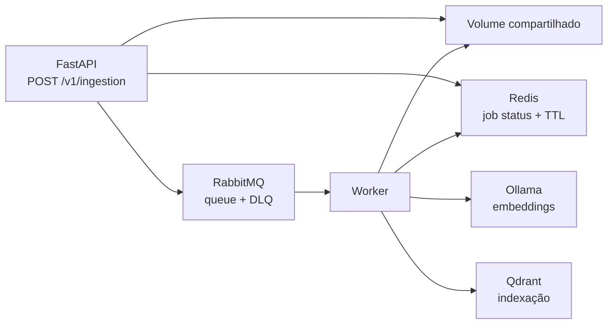

# ADR 0010 — Ingestão assíncrona com RabbitMQ e Redis

## Status

Aceita.

## Contexto

O pipeline de ingestão gera embeddings no Ollama e grava vetores no Qdrant. Essas operações podem demorar ou falhar por dependências externas. Executá-las dentro de uma requisição HTTP mantém o worker da FastAPI ocupado, aumenta o risco de timeout e mistura a disponibilidade da API com a disponibilidade do processamento.

A ingestão também precisa expor um estado consultável. RabbitMQ transporta mensagens, mas não é o armazenamento apropriado para o status de negócio de um job.

## Decisão

O endpoint `POST /v1/ingestion` recebe um arquivo Markdown autenticado, grava o arquivo e seu manifesto em um volume compartilhado, registra `queued` no Redis e publica um `IngestionJob` durável no RabbitMQ. O endpoint retorna `202 Accepted` e um `job_id`.

Um worker separado consome a fila e reutiliza `app.ingestion.pipeline.ingest_document`. Ele atualiza o status no Redis, confirma a mensagem somente após concluir o processamento e reenfileira falhas até o limite configurado. Falhas que excedem o limite seguem para a dead-letter queue.

O worker valida o tenant do manifesto contra o tenant do job. A etapa de grafo é idempotente e também é executada quando o pipeline de Qdrant retorna `skipped`, permitindo reconstruir o grafo depois de uma falha parcial.

## Alternativas consideradas

### Executar dentro da FastAPI

Rejeitada. Aumenta o tempo de resposta, ocupa workers HTTP e não oferece retry, backpressure ou isolamento de falhas de forma adequada.

### Redis como fila principal

Rejeitada para este caso. Redis pode oferecer filas, mas RabbitMQ fornece semântica de confirmação, roteamento e dead-letter mais direta para o processamento de mensagens. Redis fica dedicado ao estado de consulta e ao TTL.

### Kafka

Adiada. Kafka seria apropriado para alto volume, retenção de eventos e múltiplos consumidores independentes, mas adicionaria complexidade sem necessidade para o volume e o fluxo atuais.

### Object storage em vez de volume compartilhado

Adiada para uma implantação multi-host. O volume compartilhado é suficiente para o Compose local. O contrato do job deve evoluir para aceitar uma URI de object storage quando API e worker não compartilharem filesystem.

## Consequências

### Positivas

- A API responde rapidamente com `202`.
- Embeddings e indexação são executados fora do processo HTTP.
- Jobs podem ser repetidos e encaminhados para DLQ.
- O status é consultável por `GET /v1/ingestion/{job_id}`.
- O pipeline de domínio existente permanece reutilizável e testável sem RabbitMQ.

### Negativas e riscos

- RabbitMQ, Redis e worker passam a ser dependências operacionais.
- O volume compartilhado não resolve execução em múltiplos hosts.
- O status no Redis expira por TTL e não é um histórico de auditoria permanente.
- A operação precisa observar fila, retries, DLQ e jobs presos em `processing`.

## Contratos

O tenant do job é derivado do token autenticado. O worker não aceita que o cliente altere a identidade. A mensagem possui `schema_version`, `job_id`, `request_id`, tenant, documento, versão, manifesto e tentativa atual.

## Referências

- [`app/main.py`](../../app/main.py)
- [`app/messaging/rabbitmq.py`](../../app/messaging/rabbitmq.py)
- [`app/messaging/redis_store.py`](../../app/messaging/redis_store.py)
- [`app/worker/ingestion_worker.py`](../../app/worker/ingestion_worker.py)
- [`docs/rag-arquitetura-explicacao-local-v1.md`](../rag-arquitetura-explicacao-local-v1.md)
