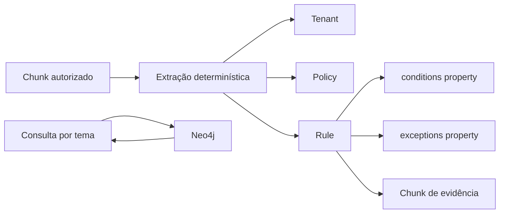

# ADR 0011 — Grafo de conhecimento complementar ao RAG

## Status

Aceita.

## Contexto

O Qdrant recupera texto por similaridade e a busca lexical encontra termos relevantes, mas relações explícitas entre políticas, regras, condições, exceções e evidências não são representadas diretamente. Essas relações são úteis para auditoria e para perguntas que dependem de uma regra aplicável.

## Decisão

Adicionar um grafo de conhecimento opcional em Neo4j. O worker constrói o grafo após indexar chunks no Qdrant. A extração inicial é determinística, limitada a tópicos, valores monetários, condições e exceções reconhecíveis. Cada regra possui `tenant_id` e referência ao chunk de origem; condições e exceções são propriedades da regra nesta primeira versão.

O grafo complementa, mas não substitui, o Qdrant. A consulta explícita está disponível em `GET /v1/knowledge-graph/rules`; o fluxo textual do `/v1/ask` continua protegido pelo retrieval híbrido existente. A ativação é controlada por `KNOWLEDGE_GRAPH_ENABLED`.

## Alternativas consideradas

- **Somente Qdrant:** mantém excelente recuperação textual, mas não representa relações explícitas.
- **Extrair tudo com LLM:** rejeitado na primeira fase por menor determinismo, custo e dificuldade de auditoria.
- **Neo4j como substituto do Qdrant:** rejeitado; texto e embeddings continuam sendo evidências importantes para o RAG.

## Consequências

- Relações de regras ficam consultáveis e visualizáveis.
- A origem textual permanece rastreável pelo chunk.
- Neo4j passa a ser uma dependência do Compose quando o grafo está habilitado.
- A extração atual não cobre toda a semântica jurídica ou temporal das políticas.
- O isolamento por tenant precisa ser aplicado em toda consulta ao grafo.

## Referências

- [`app/knowledge_graph/extractor.py`](../../app/knowledge_graph/extractor.py)
- [`app/knowledge_graph/neo4j_repository.py`](../../app/knowledge_graph/neo4j_repository.py)
- [`app/worker/ingestion_worker.py`](../../app/worker/ingestion_worker.py)
- [`app/main.py`](../../app/main.py)
