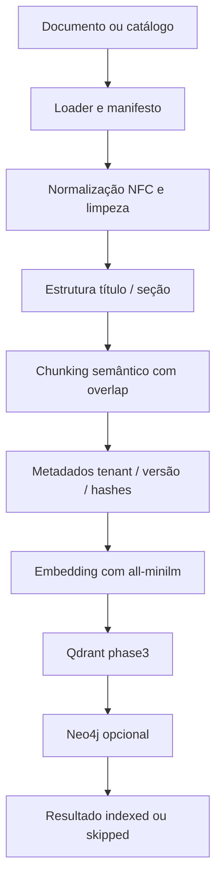
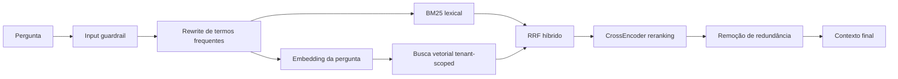
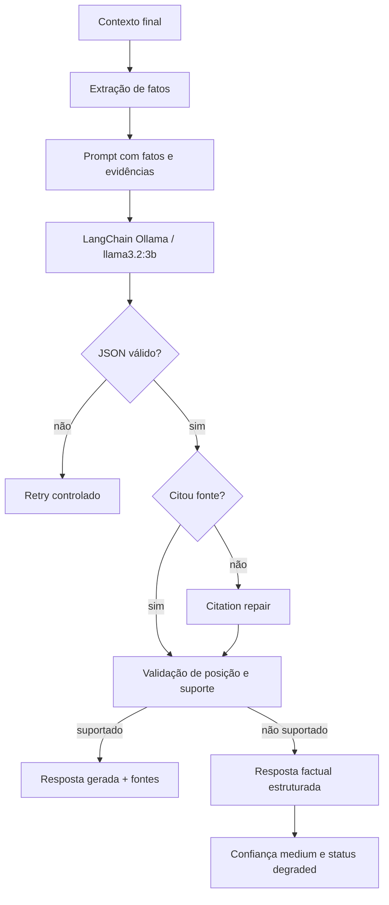
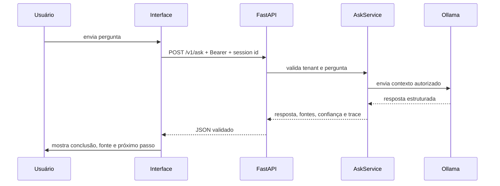
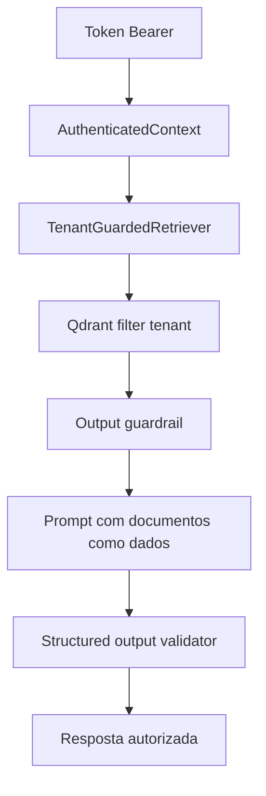
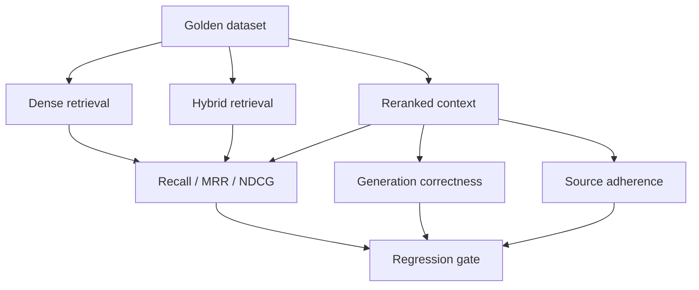
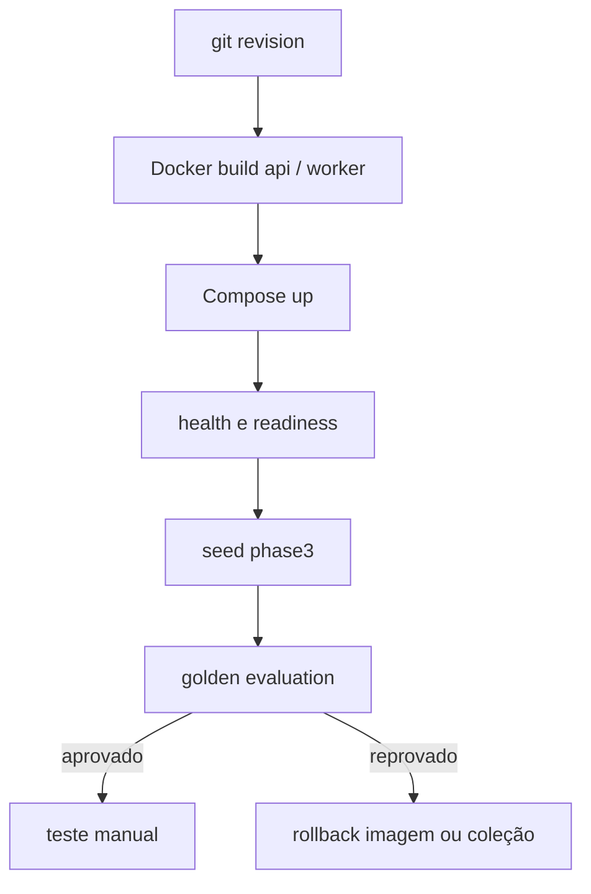
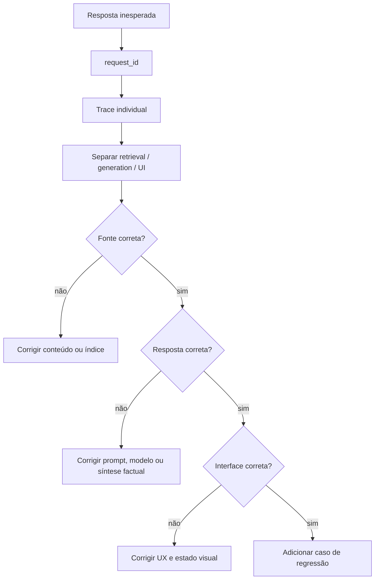

# Fluxos Operacionais do Sistema

Este documento conecta Produto, UX, IA e Engenharia por meio dos fluxos reais do projeto.

## 1. Ingestão e indexação



**Código:** `app/ingestion`, `scripts/seed_demo.py`, `app/retrieval/dense.py`.

**Contrato:** uma versão idêntica é `skipped`; uma versão alterada com o mesmo identificador é conflito; uma nova coleção deve ser usada quando o contrato de chunking mudar.

## 2. Consulta e retrieval



**Código:** `app/generation/service.py`, `app/retrieval/hybrid.py`, `app/retrieval/fusion.py`, `app/retrieval/reranker.py`, `app/retrieval/context.py`.

**Regra:** `tenant_id` é filtro de autorização no backend; não é uma instrução delegada ao modelo.

## 3. Geração grounded



**Código:** `app/generation/prompts.py`, `app/generation/grounded_answers.py`, `app/generation/langchain_ollama_provider.py`, `app/generation/service.py`.

## 4. Resposta HTTP e experiência



## 5. Segurança



## 6. Observabilidade

```mermaid
flowchart LR
    A[HTTP middleware] --> B[request counter]
    C[AskService] --> D[latências por etapa]
    C --> E[trace de documentos]
    C --> F[ObservabilityStore SQLite]
    B --> G[/metrics Prometheus]
    D --> G
    E --> H[/observability/responses]
    F --> H
    H --> I[/metrics/ui]
```

## 7. Avaliação



## 8. Deploy local e rollback



## 9. Fluxo de uma falha


