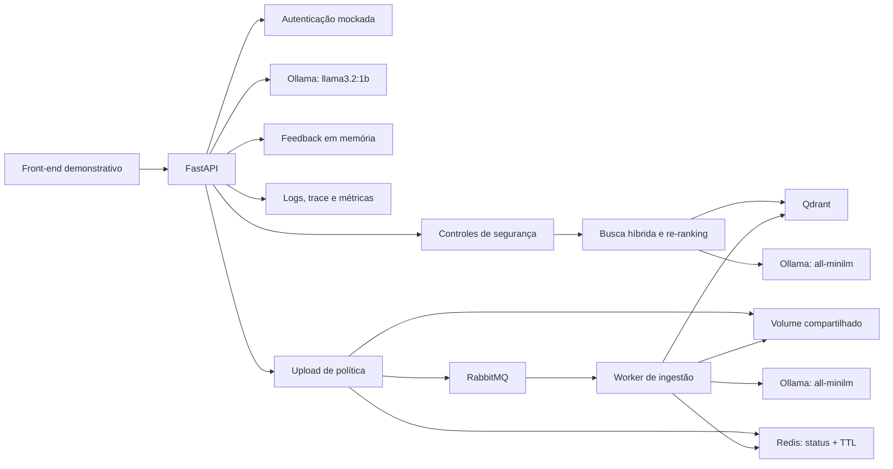
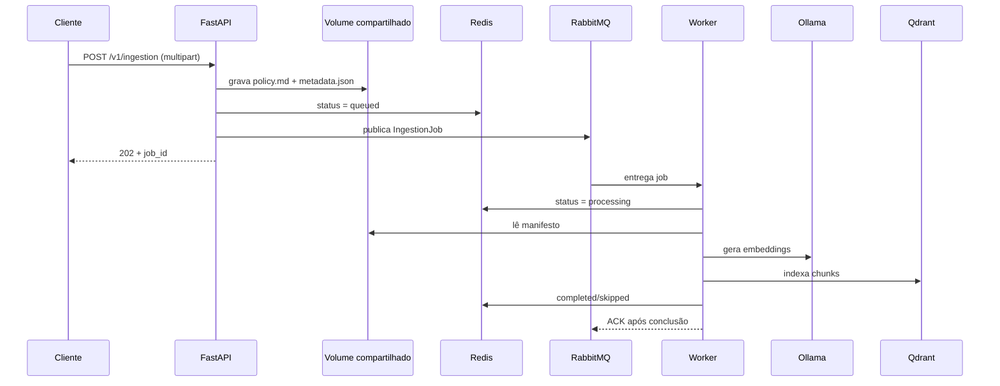

# Arquitetura do Onfly Policy Copilot

## Visão geral

O projeto usa uma arquitetura modular. Isso significa que autenticação, recuperação, geração, segurança, feedback e interface possuem responsabilidades separadas.

## Fluxo de uma consulta

1. O avaliador escolhe Aurora ou Brisa na interface.
2. A API valida a credencial sintética e devolve um token assinado.
3. O front envia somente a pergunta e o token.
4. A API obtém o tenant do token e bloqueia prompt injection conhecida.
5. O Ollama transforma a pergunta em embedding, que é um vetor numérico de significado.
6. Qdrant e BM25 recuperam candidatos somente do tenant autenticado.
7. O CrossEncoder reordena os candidatos em uma thread de trabalho para não bloquear a API.
8. O `llama3.2:1b` recebe somente o contexto autorizado e produz JSON validado.
9. A resposta inclui fontes, confiança, `request_id` e tempos por componente.
10. O feedback só é aceito se o `request_id` pertencer ao mesmo tenant.

## Fluxo de ingestão assíncrona

1. Um usuário autenticado envia um arquivo Markdown para `POST /v1/ingestion`.
2. A API grava o arquivo e um manifesto no volume compartilhado usando um `job_id` como diretório.
3. A API grava `queued` no Redis e publica uma mensagem durável no RabbitMQ.
4. A API responde `202 Accepted`; ela não aguarda embeddings nem indexação.
5. O worker lê o manifesto, reutiliza `ingest_document` e atualiza o status no Redis.
6. Falhas são reenfileiradas até o limite configurado; depois são encaminhadas à dead-letter queue.

## Fronteiras importantes

- O navegador nunca informa `tenant_id`.
- O token fica somente na memória da aba.
- Texto vindo da API é exibido como texto, não como HTML executável.
- Feedback não guarda pergunta, resposta, token ou credencial.
- Dados e credenciais são inteiramente sintéticos.

## Execução

No modo local, Qdrant usa uma pasta persistente e Ollama roda no computador. No Compose, Qdrant vira um serviço HTTP persistente, RabbitMQ e Redis rodam como serviços, e API e worker montam o volume `ingestion_data`. API e worker acessam o Ollama do computador por `host.docker.internal`.

O volume compartilhado é uma decisão de simplicidade para o ambiente local. Em múltiplos hosts, o contrato do job deve apontar para object storage em vez de depender de um caminho local.
