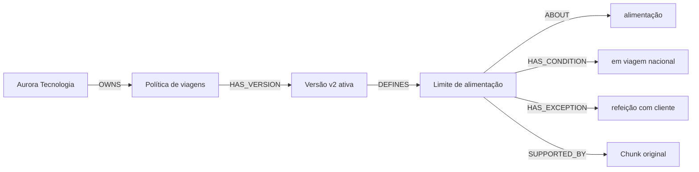

# Ontologia de conhecimento das políticas

## Para que serve

Este documento explica como uma política corporativa é representada no Neo4j. A ontologia transforma texto em conceitos e relações que podem ser consultados sem perder a referência ao documento original.

O grafo não substitui o Qdrant. O Qdrant guarda o texto e os embeddings para busca semântica; o Neo4j representa relações explícitas entre empresa, política, versão, regra, condição, exceção, tema e evidência.

## Um exemplo de negócio

Considere a frase:

> Em viagem nacional, o limite de alimentação é R$ 130,00 por dia, exceto em refeição com cliente.

Ela é representada assim:



O leitor pode interpretar o caminho da esquerda para a direita como uma frase:

> A Aurora possui uma política; a política possui uma versão ativa; a versão define uma regra; a regra trata de alimentação, possui uma condição, possui uma exceção e é comprovada por um trecho original.

## Vocabulário

### `Tenant`

Empresa proprietária das políticas. No projeto, exemplos são `aurora_tecnologia` e `brisa_sistemas`.

Propriedade principal:

| Propriedade | Significado | Exemplo |
|---|---|---|
| `id` | identificador estável da empresa | `aurora_tecnologia` |

### `Policy`

Documento lógico de política. Ele representa a política ao longo do tempo, independentemente de suas versões.

| Propriedade | Significado | Exemplo |
|---|---|---|
| `id` | chave composta do tenant e documento | `aurora_tecnologia:alimentacao` |
| `tenant_id` | empresa proprietária | `aurora_tecnologia` |
| `document_id` | identificador funcional do documento | `alimentacao` |
| `title` | título apresentado ao usuário | `Política de alimentação` |

### `PolicyVersion`

Versão concreta da política. É a unidade que possui validade e pode estar ativa ou inativa.

| Propriedade | Significado | Exemplo |
|---|---|---|
| `id` | chave composta incluindo a versão | `aurora_tecnologia:alimentacao:v2` |
| `version` | número da versão | `v2` |
| `active` | indica se participa da consulta | `true` |
| `valid_from` | início da vigência | `2026-01-01` |
| `valid_until` | fim opcional da vigência | `2026-12-31` |
| `extractor_version` | versão do extrator que criou os fatos | `rules_v2` |

### `Rule`

Regra operacional extraída de um ou mais chunks.

| Propriedade | Significado | Exemplo |
|---|---|---|
| `topic` | tema principal identificado | `alimentação` |
| `statement` | texto resumido da regra | `limite de R$ 130,00 por dia` |
| `amount` | valor numérico, quando identificado | `130.0` |
| `currency` | moeda identificada | `BRL` |
| `conditions` | condições textuais extraídas | `em viagem nacional` |
| `exceptions` | exceções textuais extraídas | `refeição com cliente` |
| `active` | estado operacional da regra | `true` |
| `tenant_id` | fronteira de segurança | `aurora_tecnologia` |

### `Topic`

Tema normalizado para facilitar consultas, como `alimentação`, `hospedagem` ou `reembolso`.

### `Condition`

Condição que limita quando uma regra se aplica. Na primeira versão, o texto da condição é usado como identificador do nó.

### `Exception`

Situação que altera ou exclui a aplicação da regra. Na primeira versão, o texto da exceção é usado como identificador do nó.

### `Chunk`

Trecho original que sustenta a regra. O texto completo permanece no Qdrant; o grafo guarda a referência mínima necessária para auditoria.

| Propriedade | Significado |
|---|---|
| `id` | identificador do chunk |
| `tenant_id` | empresa do chunk |
| `section` | seção Markdown de origem |

## Relacionamentos

| Relacionamento | Leitura | Exemplo |
|---|---|---|
| `OWNS` | tenant possui política | `Tenant -[:OWNS]-> Policy` |
| `HAS_VERSION` | política possui versão | `Policy -[:HAS_VERSION]-> PolicyVersion` |
| `DEFINES` | versão define regra | `PolicyVersion -[:DEFINES]-> Rule` |
| `ABOUT` | regra trata de tema | `Rule -[:ABOUT]-> Topic` |
| `HAS_CONDITION` | regra possui condição | `Rule -[:HAS_CONDITION]-> Condition` |
| `HAS_EXCEPTION` | regra possui exceção | `Rule -[:HAS_EXCEPTION]-> Exception` |
| `SUPPORTED_BY` | regra é comprovada por chunk | `Rule -[:SUPPORTED_BY]-> Chunk` |

## Consulta recomendada para o primeiro gráfico

Não comece com `MATCH (n)-[r]->(m)`, porque ele mistura todos os tenants, versões e evidências. Use um tenant e uma versão ativa:

```cypher
MATCH (t:Tenant {id: "aurora_tecnologia"})-[:OWNS]->(p:Policy)
MATCH (p)-[:HAS_VERSION]->(v:PolicyVersion {active: true})
MATCH (v)-[:DEFINES]->(r:Rule)
OPTIONAL MATCH (r)-[:ABOUT]->(topic:Topic)
OPTIONAL MATCH (r)-[:HAS_CONDITION]->(condition:Condition)
OPTIONAL MATCH (r)-[:HAS_EXCEPTION]->(exception:Exception)
RETURN t, p, v, r, topic, condition, exception
LIMIT 30
```

Esse gráfico responde: **qual regra ativa pertence a qual empresa e política, e quais são seu tema, condições e exceções?**

## Consulta focada em alimentação

```cypher
MATCH (t:Tenant {id: "aurora_tecnologia"})-[:OWNS]->(p:Policy)
      -[:HAS_VERSION]->(v:PolicyVersion {active: true})
      -[:DEFINES]->(r:Rule)-[:ABOUT]->(topic:Topic)
WHERE toLower(topic.id) CONTAINS "alimentação"
OPTIONAL MATCH (r)-[:HAS_CONDITION]->(condition:Condition)
OPTIONAL MATCH (r)-[:HAS_EXCEPTION]->(exception:Exception)
RETURN p.title, v.version, r.statement, r.amount, r.currency,
       collect(DISTINCT condition.id) AS conditions,
       collect(DISTINCT exception.id) AS exceptions
```

## Consulta de evidência

```cypher
MATCH (v:PolicyVersion {active: true})-[:DEFINES]->(r:Rule)
      -[:SUPPORTED_BY]->(chunk:Chunk)
WHERE r.topic = "alimentação"
RETURN v.version, r.statement, chunk.id, chunk.section, chunk.tenant_id
LIMIT 20
```

A coluna `chunk.id` pode ser usada para localizar o texto e os metadados no Qdrant.

## Onde o código implementa a ontologia

- Contratos: [`app/knowledge_graph/models.py`](../app/knowledge_graph/models.py#L6).
- Extração de tópicos, condições, exceções e valores: [`app/knowledge_graph/extractor.py`](../app/knowledge_graph/extractor.py#L12).
- Criação de nós, constraints e relacionamentos: [`app/knowledge_graph/neo4j_repository.py`](../app/knowledge_graph/neo4j_repository.py#L17).
- Construção durante o seed: [`scripts/seed_demo.py`](../scripts/seed_demo.py#L32).
- Construção durante jobs assíncronos: [`app/worker/ingestion_worker.py`](../app/worker/ingestion_worker.py#L47).
- Endpoint de consulta: [`app/main.py`](../app/main.py#L405).

## Limites atuais

- O grafo representa regras extraídas deterministicamente; não é uma ontologia jurídica completa.
- `Condition` e `Exception` usam texto como identificador e ainda não possuem normalização semântica avançada.
- O fluxo principal `/v1/ask` ainda usa o Qdrant como recuperação principal; a consulta Neo4j é complementar e explícita.
- Consultas temporais devem filtrar `valid_from`, `valid_until` e `active` quando essa capacidade for exposta ao produto.
