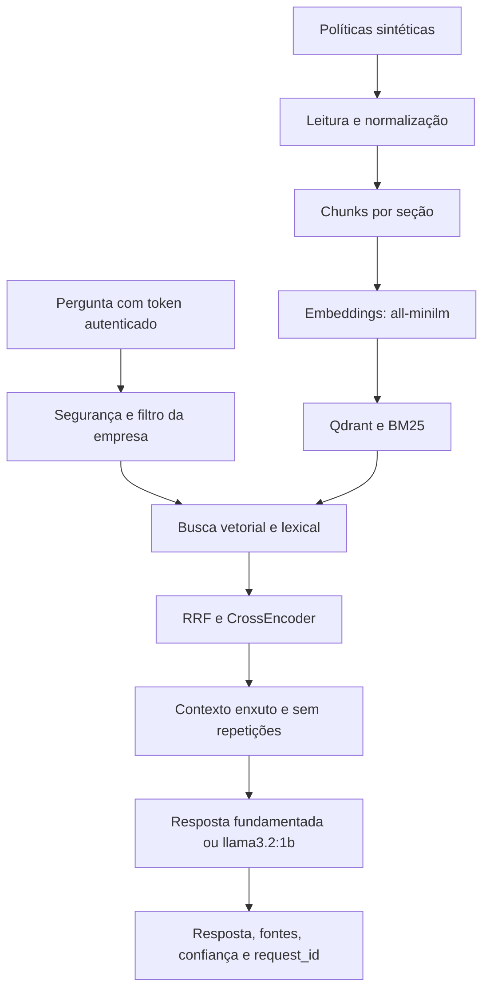

# Pipeline RAG

Este documento descreve como o Onfly Policy Copilot transforma políticas sintéticas em respostas rastreáveis. RAG significa *Retrieval-Augmented Generation*: antes de responder, a aplicação recupera evidências na base de conhecimento.

## Visão geral

## 1. Ingestão da base de conhecimento

Cada empresa fictícia possui suas próprias políticas e documentos de dúvidas frequentes. O carregamento executa estas etapas:

1. **Leitura:** abre arquivos Markdown e seus catálogos.
2. **Normalização:** remove diferenças irrelevantes de espaçamento sem mudar o significado do texto.
3. **Chunking por seção:** divide o documento em trechos menores e preserva título, seção e sobreposição configurável. *Chunk* é um trecho usado na busca.
4. **Embeddings:** o Ollama usa `all-minilm` para criar vetores numéricos que representam o significado de cada trecho.
5. **Indexação:** grava vetores e metadados no Qdrant e alimenta o índice BM25, usado para busca por termos.

Um hash identifica o conteúdo de cada documento. Assim, reenviar o mesmo arquivo não duplica seus trechos. Versões podem coexistir, mas somente a versão ativa participa da busca.

### Metadados guardados

Todo trecho guarda, no mínimo, a empresa, o documento, a versão, a seção, o identificador do trecho, o período de validade e o estado ativo. Esses dados tornam a fonte verificável e permitem aplicar o isolamento entre empresas.

## 2. Proteção antes da busca

A pessoa entra usando uma credencial fictícia. A API devolve um token assinado que identifica a empresa autorizada. O navegador envia apenas a pergunta e o token; ele não escolhe nem informa a empresa no corpo da requisição.

Antes da busca, a aplicação verifica tentativas conhecidas de *prompt injection*, isto é, textos que tentam fazer o assistente ignorar suas regras. Perguntas suspeitas são bloqueadas ou sinalizadas. A empresa do token é usada como filtro obrigatório da recuperação.

## 3. Busca híbrida e re-ranking

A recuperação combina duas formas de busca:

- **Busca vetorial:** encontra trechos com significado próximo ao da pergunta.
- **BM25:** encontra trechos com termos e palavras importantes em comum.

O RRF (*Reciprocal Rank Fusion*) combina as duas listas de resultados. Em seguida, o CrossEncoder compara diretamente a pergunta com cada candidato e reorganiza os melhores trechos por relevância. Esse segundo passo é chamado de *re-ranking*.

Depois do re-ranking, a aplicação remove trechos muito parecidos e respeita um limite de caracteres. O objetivo é enviar ao modelo somente evidências úteis, sem repetir informação ou exceder o espaço de contexto.

## 4. Geração da resposta

As perguntas frequentes sobre bagagem, hospedagem, reembolso e transporte por aplicativo recebem uma síntese direta das fontes recuperadas. Isso melhora a clareza e evita que uma regra importante fique escondida em um trecho isolado.

Para as demais perguntas, o `llama3.2:1b`, executado localmente pelo Ollama, recebe apenas o contexto permitido e devolve uma resposta estruturada. A resposta é validada antes de chegar à interface.

Se a evidência for insuficiente, a aplicação informa que não encontrou suporte na base. Ela não deve completar uma regra com conhecimento externo ou inventado.

## 5. Rastreabilidade e operação

Cada resposta inclui:

- texto de resposta;
- fontes com documento, título, trecho e pontuação;
- confiança calculada;
- `request_id`, identificador usado para localizar a requisição nos logs;
- tempos de busca, re-ranking, geração e resposta total.

Logs estruturados registram a execução sem expor credenciais ou dados sensíveis. O sistema também possui timeout, tentativas controladas e fallback para indisponibilidades temporárias do provedor local.

## Garantia de isolamento

O filtro da empresa é aplicado antes da recuperação e os resultados retornados são conferidos depois da busca. Portanto, um usuário autenticado pela Aurora não deve receber trechos da Brisa, e o contrário também é verdadeiro. Testes automatizados verificam esse comportamento.
